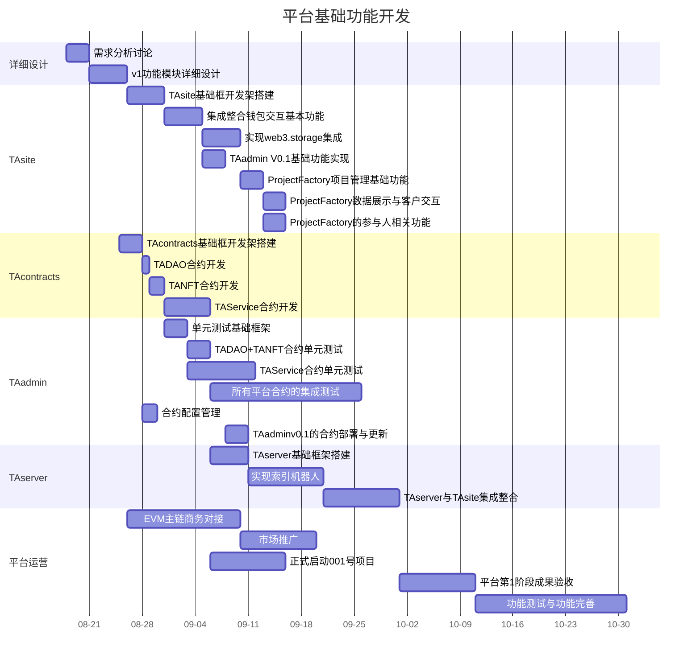
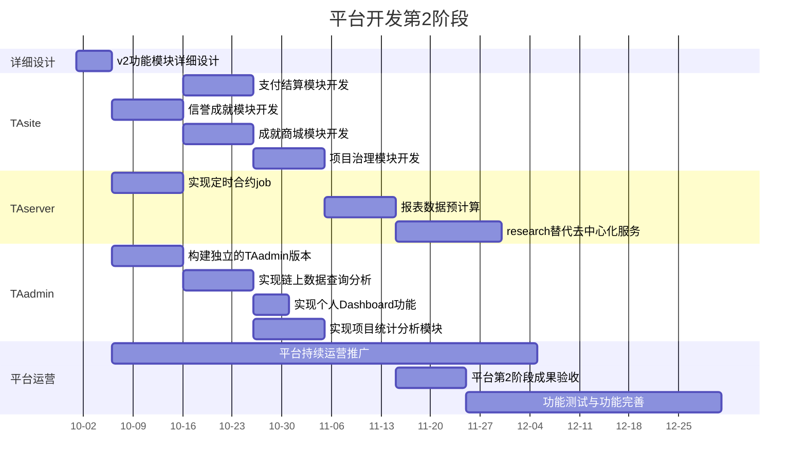

# TokenAgg DAO平台开发运营计划
+ 此计划只是按照目前已了解的功能需求进行评估计划的，如果实施过程中增加大型功能模块开发或改造，整体时间进度需要及时调整
+ **平台开发第1阶段**基本都是基于多年经验与现有项目成果进行重构，思路相对清晰，目标明确，所以第一阶段的研发内容较为详细；起始开发部分不需要外部协助，先搭建基础框架后再正式对外合伙人招募，启动后续开发工作；
+ **平台开发第2阶段**很多内容都属于初步设计阶段，所以其工作计划相对粗糙，后期将根据实际的市场与社区反馈进行调整、详细设计规划。

## 一、开发周期及任务说明
### 1.平台开发第1阶段

TokenAgg DAO平台的MVP核心功能开发，包含智能合约、网站DApp及管理后台开发

时间：2022/8/18 - 2022/10/31	耗时：74天
+ <b>1.详细设计-需求分析讨论[3*3人天]</b>： 组织核心团队进行头脑风暴，收集整理核心业务需求

+ <b>2.详细设计-v1功能模块详细设计[2*5人天]</b>： 根据需求分析结果,设计平台v1版本的功能模块, 业务流程及业务对象关系

+ <b>3.TAsite-TAsite基础框开发架搭建[3*5人天]</b>： 使用vite+vuejs+ethersjs+naive-ui+windicss实现网站的基础开发框架，包含CMS和DaReport

+ <b>4.TAsite-集成整合钱包交互基本功能[3*5人天]</b>： 实现基本的钱包交互功能，包含连接钱包、代币管理、投票等基本钱包交互

+ <b>5.TAsite-实现web3.storage集成[3*5人天]</b>： 实现web3.storage交互功能，包含上传图片/数据文件、显示图片/json数据等

+ <b>6.TAsite-TAadmin V0.1基础功能实现[2*3人天]</b>： 在TAsite中实现一个基础的管理控制台界面，提供一些基本的合约交互操作与数据展示

+ <b>7.TAsite-ProjectFactory项目管理基础功能[2*3人天]</b>： 实现ProjectFactory的项目方案编辑、发布项目、提交项目进度验收等项目管理部分基础功能

+ <b>8.TAsite-ProjectFactory数据展示与客户交互[2*3人天]</b>： 实现ProjectFactory的所有项目浏览查询、项目提案投票等项目数据展示及客户交互功能

+ <b>9.TAsite-ProjectFactory的参与人相关功能[2*3人天]</b>： 实现ProjectFactory的应聘项目职位、领取项目任务、我参与的项目、项目进度提交、项目奖励记录等项目参与人的相关功能

+ <b>10.TAcontracts-TAcontracts基础框开发架搭建[2*3人天]</b>： 使用Hardhat+etherjs+openzeppelin+foundry构建合约开发的基础框架

+ <b>11.TAcontracts-TADAO合约开发[3*1人天]</b>： 开发实现TADAO的ERC20合约

+ <b>12.TAcontracts-TANFT合约开发[3*2人天]</b>： 开发实现TANFT的ERC721合约，并包含成就点数与徽章基础功能

+ <b>13.TAcontracts-TAService合约开发[3*6人天]</b>： 开发实现TAService合约，包含发起提案、投票、验收项目成果等基础业务功能

+ <b>14.TAadmin-单元测试基础框架[3*3人天]</b>： 使用jest搭建项目的单元测试基础框架，包含一些合约基础测试环境与用例

+ <b>15.TAadmin-TADAO+TANFT合约单元测试[5*3人天]</b>： 实现TADAO+TANFT合约的单元测试用例

+ <b>16.TAadmin-TAService合约单元测试[1*9人天]</b>： TAService合约单元测试

+ <b>17.TAadmin-所有平台合约的集成测试[1*20人天]</b>： 准备完善的测试环境，完整测试各个实际应用场景

+ <b>18.TAadmin-合约配置管理[1*2人天]</b>： 实现合约代码的公共部分配置生成与版本管理

+ <b>19.TAadmin-TAadminv0.1的合约部署与更新[5*3人天]</b>： 在TAadmin v0.1中实现合约部署与更新

+ <b>20.TAserver-TAserver基础框架搭建[2*5人天]</b>： 使用Nestjs+prisma+ethers实现TAserver基础框架

+ <b>21.TAserver-实现索引机器人[5*10人天]</b>： 实现索引机器人，定时爬取链上代币持仓人与交易记录等信息

+ <b>22.TAserver-TAserver与TAsite集成整合[5*10人天]</b>： TAserver与TAsite集成整合API调用

+ <b>23.平台运营-EVM主链商务对接[2*15人天]</b>： 与各大EVM主链进行商务对接，获取项目资助与扶持资金

+ <b>24.平台运营-市场推广[5*10人天]</b>： 开始市场推广宣传，招募平台合伙人

+ <b>25.平台运营-正式启动001号项目[5*10人天]</b>： 对外公开，正式开始启动TADAO项目的开发工作

+ <b>26.平台运营-平台第1阶段成果验收[5*10人天]</b>： 开始平台第1阶段成果验收，并总结讨论下1阶段的工作计划

+ <b>27.平台运营-功能测试与功能完善[3*20人天]</b>： 完善平台功能细节,修复bug

### 2.平台开发第2阶段

整合现有资源，实施TokenAgg DAO平台的运营推广宣传计划，并逐步拓展完善业务功能

时间：2022/10/1 - 2022/12/31	耗时：91天
+ <b>1.详细设计-v2功能模块详细设计[2*5人天]</b>： 根据市场及社区反馈，详细设计平台v2版本的功能模块

+ <b>2.TAsite-支付结算模块开发[5*10人天]</b>： 完成支付结算模块开发

+ <b>3.TAsite-信誉成就模块开发[5*10人天]</b>： 完成信誉成就模块开发

+ <b>4.TAsite-成就商城模块开发[5*10人天]</b>： 完成成就商城模块开发

+ <b>5.TAsite-项目治理模块开发[5*10人天]</b>： 完成项目治理模块开发

+ <b>6.TAserver-实现定时合约job[5*10人天]</b>： 实现定时合约job，包含数据预计算、索引数据核对等

+ <b>7.TAserver-报表数据预计算[5*10人天]</b>： 报表数据预计算，包含代币实时统计信息、地址持仓分析等

+ <b>8.TAserver-research替代去中心化服务[3*15人天]</b>： 研究第三方服务，寻找替代方案

+ <b>9.TAadmin-构建独立的TAadmin版本[5*10人天]</b>： 构建独立的TAadmin版本，提供基础的开发框架

+ <b>10.TAadmin-实现链上数据查询分析[5*10人天]</b>： 实现定时合约job，包含数据预计算、索引数据核对等

+ <b>11.TAadmin-实现个人Dashboard功能[5*5人天]</b>： 开发实现个人Dashboard功能

+ <b>12.TAadmin-实现项目统计分析模块[5*10人天]</b>： 实现项目统计分析模块

+ <b>13.平台运营-平台持续运营推广[1*60人天]</b>： 整合平台现有客户资源,进行平台持续运营推广

+ <b>14.平台运营-平台第2阶段成果验收[5*10人天]</b>： 开始平台第2阶段成果验收，并总结讨论下1阶段的工作计划

+ <b>15.平台运营-功能测试与功能完善[3*36人天]</b>： 完善平台功能细节,修复bug

## 二、报价明细
### 1.平台开发费用
<table>
    <tr>
        <td align="center"><b>功能模块</b></td>
        <td align="center"><b>人员类型</b></td>
        <td align="center"><b>人员</b></td>
        <td align="center"><b>工作量(人天)</b></td>
        <td align="center"><b>价格(万元)</b></td>
    </tr>
<tr>
        <td colspan="4"><b>[平台开发第1阶段]平台基础功能开发</b></td>
        <td align="right"><b>44.98</b></td>
    </tr>
<tr>
        <td>1.详细设计-需求分析讨论</td>
        <td>项目管理</td>
        <td align="center">3</td>
	      <td align="center">3</td>
	      <td align="right">1.35</td>
    </tr>
<tr>
        <td>2.详细设计-v1功能模块详细设计</td>
        <td>项目管理</td>
        <td align="center">2</td>
	      <td align="center">5</td>
	      <td align="right">1.5</td>
    </tr>
<tr>
        <td>3.TAsite-TAsite基础框开发架搭建</td>
        <td>本地开发</td>
        <td align="center">3</td>
	      <td align="center">5</td>
	      <td align="right">1.2</td>
    </tr>
<tr>
        <td>4.TAsite-集成整合钱包交互基本功能</td>
        <td>本地开发</td>
        <td align="center">3</td>
	      <td align="center">5</td>
	      <td align="right">1.2</td>
    </tr>
<tr>
        <td>5.TAsite-实现web3.storage集成</td>
        <td>本地开发</td>
        <td align="center">3</td>
	      <td align="center">5</td>
	      <td align="right">1.2</td>
    </tr>
<tr>
        <td>6.TAsite-TAadmin V0.1基础功能实现</td>
        <td>本地开发</td>
        <td align="center">2</td>
	      <td align="center">3</td>
	      <td align="right">0.48</td>
    </tr>
<tr>
        <td>7.TAsite-ProjectFactory项目管理基础功能</td>
        <td>本地开发</td>
        <td align="center">2</td>
	      <td align="center">3</td>
	      <td align="right">0.48</td>
    </tr>
<tr>
        <td>8.TAsite-ProjectFactory数据展示与客户交互</td>
        <td>本地开发</td>
        <td align="center">2</td>
	      <td align="center">3</td>
	      <td align="right">0.48</td>
    </tr>
<tr>
        <td>9.TAsite-ProjectFactory的参与人相关功能</td>
        <td>本地开发</td>
        <td align="center">2</td>
	      <td align="center">3</td>
	      <td align="right">0.48</td>
    </tr>
<tr>
        <td>10.TAcontracts-TAcontracts基础框开发架搭建</td>
        <td>本地开发</td>
        <td align="center">2</td>
	      <td align="center">3</td>
	      <td align="right">0.48</td>
    </tr>
<tr>
        <td>11.TAcontracts-TADAO合约开发</td>
        <td>本地开发</td>
        <td align="center">3</td>
	      <td align="center">1</td>
	      <td align="right">0.24</td>
    </tr>
<tr>
        <td>12.TAcontracts-TANFT合约开发</td>
        <td>本地开发</td>
        <td align="center">3</td>
	      <td align="center">2</td>
	      <td align="right">0.48</td>
    </tr>
<tr>
        <td>13.TAcontracts-TAService合约开发</td>
        <td>本地开发</td>
        <td align="center">3</td>
	      <td align="center">6</td>
	      <td align="right">1.44</td>
    </tr>
<tr>
        <td>14.TAadmin-单元测试基础框架</td>
        <td>本地开发</td>
        <td align="center">3</td>
	      <td align="center">3</td>
	      <td align="right">0.72</td>
    </tr>
<tr>
        <td>15.TAadmin-TADAO+TANFT合约单元测试</td>
        <td>测试人员</td>
        <td align="center">5</td>
	      <td align="center">3</td>
	      <td align="right">0.9</td>
    </tr>
<tr>
        <td>16.TAadmin-TAService合约单元测试</td>
        <td>项目管理</td>
        <td align="center">1</td>
	      <td align="center">9</td>
	      <td align="right">1.35</td>
    </tr>
<tr>
        <td>17.TAadmin-所有平台合约的集成测试</td>
        <td>实施运维</td>
        <td align="center">1</td>
	      <td align="center">20</td>
	      <td align="right">2.0</td>
    </tr>
<tr>
        <td>18.TAadmin-合约配置管理</td>
        <td>实施运维</td>
        <td align="center">1</td>
	      <td align="center">2</td>
	      <td align="right">0.2</td>
    </tr>
<tr>
        <td>19.TAadmin-TAadminv0.1的合约部署与更新</td>
        <td>本地开发</td>
        <td align="center">5</td>
	      <td align="center">3</td>
	      <td align="right">1.2</td>
    </tr>
<tr>
        <td>20.TAserver-TAserver基础框架搭建</td>
        <td>实施运维</td>
        <td align="center">2</td>
	      <td align="center">5</td>
	      <td align="right">1.0</td>
    </tr>
<tr>
        <td>21.TAserver-实现索引机器人</td>
        <td>本地开发</td>
        <td align="center">5</td>
	      <td align="center">10</td>
	      <td align="right">4.0</td>
    </tr>
<tr>
        <td>22.TAserver-TAserver与TAsite集成整合</td>
        <td>本地开发</td>
        <td align="center">5</td>
	      <td align="center">10</td>
	      <td align="right">4.0</td>
    </tr>
<tr>
        <td>23.平台运营-EVM主链商务对接</td>
        <td>实施运维</td>
        <td align="center">2</td>
	      <td align="center">15</td>
	      <td align="right">3.0</td>
    </tr>
<tr>
        <td>24.平台运营-市场推广</td>
        <td>本地开发</td>
        <td align="center">5</td>
	      <td align="center">10</td>
	      <td align="right">4.0</td>
    </tr>
<tr>
        <td>25.平台运营-正式启动001号项目</td>
        <td>本地开发</td>
        <td align="center">5</td>
	      <td align="center">10</td>
	      <td align="right">4.0</td>
    </tr>
<tr>
        <td>26.平台运营-平台第1阶段成果验收</td>
        <td>本地开发</td>
        <td align="center">5</td>
	      <td align="center">10</td>
	      <td align="right">4.0</td>
    </tr>
<tr>
        <td>27.平台运营-功能测试与功能完善</td>
        <td>测试人员</td>
        <td align="center">3</td>
	      <td align="center">20</td>
	      <td align="right">3.6</td>
    </tr>
<tr>
        <td colspan="4"><b>[平台开发第2阶段]平台开发第2阶段</b></td>
        <td align="right"><b>57.48</b></td>
    </tr>
<tr>
        <td>1.详细设计-v2功能模块详细设计</td>
        <td>项目管理</td>
        <td align="center">2</td>
	      <td align="center">5</td>
	      <td align="right">1.5</td>
    </tr>
<tr>
        <td>2.TAsite-支付结算模块开发</td>
        <td>本地开发</td>
        <td align="center">5</td>
	      <td align="center">10</td>
	      <td align="right">4.0</td>
    </tr>
<tr>
        <td>3.TAsite-信誉成就模块开发</td>
        <td>本地开发</td>
        <td align="center">5</td>
	      <td align="center">10</td>
	      <td align="right">4.0</td>
    </tr>
<tr>
        <td>4.TAsite-成就商城模块开发</td>
        <td>本地开发</td>
        <td align="center">5</td>
	      <td align="center">10</td>
	      <td align="right">4.0</td>
    </tr>
<tr>
        <td>5.TAsite-项目治理模块开发</td>
        <td>本地开发</td>
        <td align="center">5</td>
	      <td align="center">10</td>
	      <td align="right">4.0</td>
    </tr>
<tr>
        <td>6.TAserver-实现定时合约job</td>
        <td>本地开发</td>
        <td align="center">5</td>
	      <td align="center">10</td>
	      <td align="right">4.0</td>
    </tr>
<tr>
        <td>7.TAserver-报表数据预计算</td>
        <td>本地开发</td>
        <td align="center">5</td>
	      <td align="center">10</td>
	      <td align="right">4.0</td>
    </tr>
<tr>
        <td>8.TAserver-research替代去中心化服务</td>
        <td>测试人员</td>
        <td align="center">3</td>
	      <td align="center">15</td>
	      <td align="right">2.7</td>
    </tr>
<tr>
        <td>9.TAadmin-构建独立的TAadmin版本</td>
        <td>本地开发</td>
        <td align="center">5</td>
	      <td align="center">10</td>
	      <td align="right">4.0</td>
    </tr>
<tr>
        <td>10.TAadmin-实现链上数据查询分析</td>
        <td>本地开发</td>
        <td align="center">5</td>
	      <td align="center">10</td>
	      <td align="right">4.0</td>
    </tr>
<tr>
        <td>11.TAadmin-实现个人Dashboard功能</td>
        <td>本地开发</td>
        <td align="center">5</td>
	      <td align="center">5</td>
	      <td align="right">2.0</td>
    </tr>
<tr>
        <td>12.TAadmin-实现项目统计分析模块</td>
        <td>本地开发</td>
        <td align="center">5</td>
	      <td align="center">10</td>
	      <td align="right">4.0</td>
    </tr>
<tr>
        <td>13.平台运营-平台持续运营推广</td>
        <td>运营策划</td>
        <td align="center">1</td>
	      <td align="center">60</td>
	      <td align="right">4.8</td>
    </tr>
<tr>
        <td>14.平台运营-平台第2阶段成果验收</td>
        <td>本地开发</td>
        <td align="center">5</td>
	      <td align="center">10</td>
	      <td align="right">4.0</td>
    </tr>
<tr>
        <td>15.平台运营-功能测试与功能完善</td>
        <td>测试人员</td>
        <td align="center">3</td>
	      <td align="center">36</td>
	      <td align="right">6.48</td>
    </tr>
</table>
+ 人员平均成本:
	+ 本地开发:	2.4万元/月
	+ 测试人员:	1.8万元/月
	+ 实施运维:	3.0万元/月
	+ 项目管理:	4.5万元/月
	+ 运营策划:	2.4万元/月
+ 平台开发费用粗略按照人工耗时*人员工时工资进行计算,没有包含人员占用空闲时间成本及额外加班成本,所以整体时间预估相对宽松
### 2.实施运维费用
<table>
    <tr>
        <td align="center"><b>细项</b></td>
        <td align="center"><b>规格</b></td>
        <td align="center"><b>数量</b></td>
        <td align="center"><b>总价(万元)</b></td>
        <td align="center"><b>备注</b></td>
    </tr>
<tr>
        <td colspan="3" align="center"><b>外部采购</b></td>
        <td align="right"><b>3.18</b></td>
	      <td></td>
    </tr>
<tr>
        <td>注册认证</td>
        <td>域名、SSL证书及其他平台认证
</td>
        <td align="center">1</td>
        <td align="right">0.18</td>
        <td>3年</td>
    </tr>
<tr>
        <td>云服务租用</td>
        <td>云服务器及相关云服务的租赁, 1台主服务器+1台从服务器+1台备份/测试服务器
</td>
        <td align="center">3</td>
        <td align="right">3.0</td>
        <td>1年</td>
    </tr>
<tr>
        <td colspan="3" align="center"><b>平台服务</b></td>
        <td align="right"><b>5.2</b></td>
	      <td></td>
    </tr>
<tr>
        <td>平台运维</td>
        <td>定期对平台进行运维工作，保证平台正常运作
</td>
        <td align="center">1</td>
        <td align="right">1.2</td>
        <td>1人1年</td>
    </tr>
<tr>
        <td>技术支持</td>
        <td>平台技术支持, 24小时*7天
</td>
        <td align="center">1</td>
        <td align="right">2.0</td>
        <td>1人1年</td>
    </tr>
<tr>
        <td>平台运营推广</td>
        <td>平台新闻资讯编辑发布, 2-5次/周
</td>
        <td align="center">1</td>
        <td align="right">2.0</td>
        <td>1人1年</td>
    </tr>
</table>
### 3.合计
<table>
    <tr>
        <td align="center"><b>类别</b></td>
        <td align="center"><b>细项</b></td>
        <td align="center"><b>费用(万元)</b></td>
    </tr>
<tr>
        <td rowspan="2">平台开发</td>
        <td>[平台开发第1阶段]平台基础功能开发</td>
        <td align="right">44.98</td>
    </tr>
<tr>
        <td>[平台开发第2阶段]平台开发第2阶段</td>
        <td align="right">57.48</td>
    </tr>
<tr>
        <td rowspan="2">实施运维</td>
        <td>外部采购</td>
        <td align="right">3.18</td>
    </tr>
<tr>
        <td>平台服务</td>
        <td align="right">5.2</td>
    </tr>
  <tr>
	<td align="right" colspan="2"><b>合计</b></td>
	<td align="right"><b>110.84</b></td>
    </tr>
</table>
