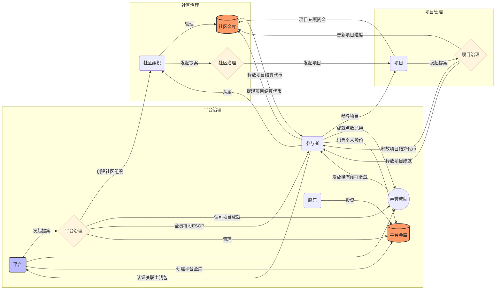
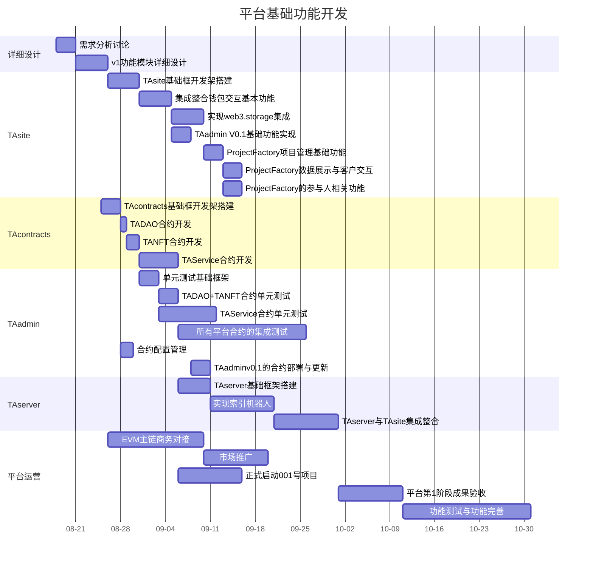
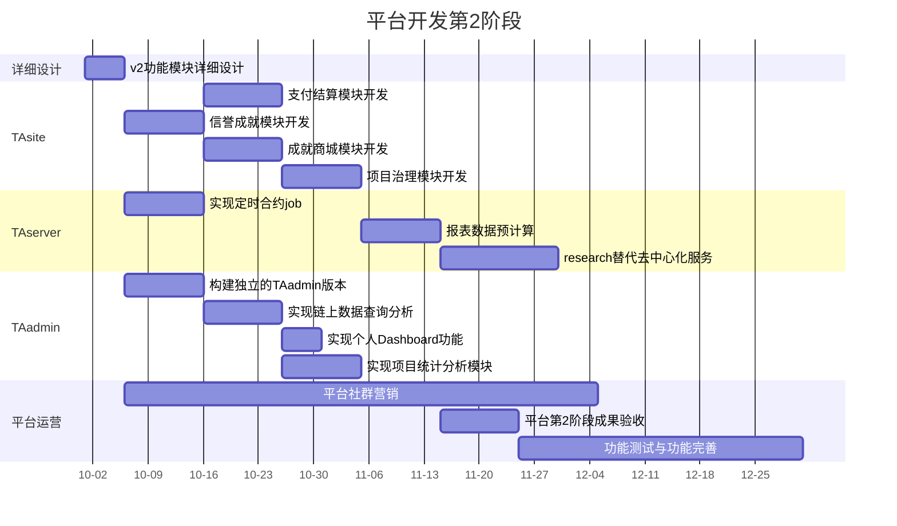

# TokenAgg DAO

## 一、平台简介

​		社区自治的区块链项目综合服务平台

​		我们致力于研发、提供基于DAO的区块链项目综合服务平台。提高项目研发效率，降低运营管理成本，汇聚优秀项目方、团队/人才深度合作，形成多种支撑和延展，充分整合资源，实现跨界融合，构建立体全方位的项目综合服务生态圈，成为新一代区块链产业价值链的组织者。

### 1. 亮点

|💡DApp|⚡️自我构建|🚀DAO|
| :----------------------------------------------------------: | :----------------------------------------------------------: | :----------------------------------------------------------: |
| 整合现有成熟技术，尽可能保证去中心化运作，数据都在链上，随时可以换个“管家”管理你的数据。 | “吃自己的狗粮！” 1号项目就是TADAO。就是所有项目的参考模板。 | 完全社群自治，所有生态建设者共同决策。低门槛让所有人都能发表自己的观点，实验自己的想法。 |
|**🧙一站式服务**|**👨‍👩‍👧‍👦利他，成就他人**|**🧭开源，开放**|
| 一站式服务，包含项目众筹、产品研发、市场运营、金融衍生品等等。只要是需要的服务，总有专业的人员为您服务；但恶意服务也会社群集体“封杀”。 | 平台生态建设者们相互助力、相互成就，真正的互惠共赢。大家好才是真的好。 | 所有代码开源，且使用商业友好的MIT许可协议，任何团队都可以fork出不同行业的项目孵化平台。 |

### 2. 目标

### 3. 痛点分析

在代币项目开发过程中，面临许多问题：

+ **开发人员难以组织管理**
  + 区块链项目开发人员难找
  + 开发人员薪资要求高，水平差，还没有责任心，团队协作
  + 安全问题不是开发人员的事，发现隐患也隐瞒，甚至：
    + 开老鼠仓抢预售
    + 开小号盗币
  + 和外包公司一样，开发人员没有归属感和成就感
+ **团队协同困难**
  + 许多初创项目团队人员都是身兼数职，什么都行又什么都不精
  + 初创小团队都在不停“试错”，为自己的错误交“学费”。许多错误和技术难点在专业人士手中轻而易举就能解决。
  + 团队人员职责不清晰，任务目标不明确

+ **薪酬体系与晋升机制不完善**
  + 外包或小公司内薪酬体系不完善，干得多拿的少
  + 缺乏晋升机制，跳槽才是更好的选择，最终导致频繁学习新技术，技术不精

+ **财务管理不透明**
  + 区块链初创项目的财务管理不透明，员工经常因为各种原因被拖欠工资。
  + 财务支出相当不平衡，高管决定项目资金的使用偏向，普通员工无法参与决策
  + 传统实体公司的财务管理是门艺术，需要浪费大量时间与人力去“优化”

+ **项目纠纷难以处理解决**
  + 项目研发过程中容易产生各种纠纷，但项目方与服务方又难以沟通协商解决，导致最终不欢而散。
  + 项目服务过程中，沟通很重要，第三方协调也很重要
  + 现代软件项目是需要长期不断迭代完善，市场也是需要不断运营培育的，长期持久的合作才是双方需要的，相互信任很关键，也不容易纠结一些小问题

+ **项目方需要专业人士协助**
  + 项目方也不是全能的，也有不擅长，不熟悉的领域，也需要专业人士协助
  + 项目管理层什么都关注，什么都操心，反而容易累死。“专业的事交给专业的人去做”

### 4. 核心理念

+ **基于DAO的项目管理**
  + DAO类似公司，双向选择，来去自由。价值观相同的人才能共同创建伟大的事业。
  + 扁平化管理，大家都是平级的，共同参与DAO决策
  + 直接使用Token进行薪酬结算，任务启动前就协商好薪酬与奖励，投票决定完成度
  + 项目经理负责项目整体运作，其他人应聘上岗，按实际按完成工作量结算token
  + 项目方的价值观需要获得社区认同才能启动项目，不做烂项目，不赚傻叉的钱
  + 不要“面霸”，完全按照项目完成度结算薪酬，所有环节公开透明
  + 任何人都可参与项目贡献，项目所有成员投票决定奖励分配

+ **基于NFT的成就徽章**
  + 参与项目，产生有价值的贡献将获得相应的成就徽章
  + 项目价值越高，成就越高
  + 所有贡献都上链保存，完整展示个人的成长
  + 个人终身价值与DAO绑定，使得个人作恶成本更高

+ **DAO的治理代币等同于公司股票期权**
  + 参与项目才能获得成就与治理代币，参与者才是社区生态的建设者
  + 治理代币类似于全民持股计划，参与者都是主人，都能发表自己的观点、实现自己的想法
  + 投资人不仅仅只是“价值投资”，也能贡献自己的力量实现共赢

### 5. 代币经济模型

+ **治理代币TADAO**

  总发行量： 1,000,000枚，发行价：1 USDT ≈ 1 TADAO

  + 10%进入TADAO项目研发钱包，1号项目提案成功后进入项目金库，按照项目完成进度逐步释放
  + 10%进入平台市场运营钱包，1号项目MVP研发完毕后进入项目金库，作为平台市场运营费用
  + 10%加上启动BNB进入Swap平台建立流动池底池，对应的LP代币锁仓到平台金库
  + 剩余70%进入平台金库未释放部分保存

+ **权益代币TANFT**

  + 使用TADAO代币铸造TANFT，TANFT不可转移，一个钱包地址只有一个TANFT，不可重复购买。TANFT可升级。

  + TANFT包含1-5级和S级。不同级别拥有不同的权益，S级权益部分等同于5级TANFT，仅仅发放给平台联合创始人及社区定期推选的MVP人员。S级TANFT更多的代表一种荣誉与认可。

    |              | 1级TANFT | 2级TANFT  |  3级TANFT  |  4级TANFT  |  5级TANFT   |   S级TANFT    |
    | ------------ | :------: | :-------: | :--------: | :--------: | :---------: | :-----------: |
    | 兑换价格     | 1 TADAO  | 100 TADAO | 1000 TADAO | 5000 TADAO | 10000 TADAO | 平台赠与/升级 |
    | 升级成就点数 |          |   1万点   |   5万点    |   10万点   |   30万点    |               |
    | 服务费折扣   |    5%    |    10%    |    15%     |    20%     |     25%     |      25%      |
    | 成就点数获取 |    5%    |    10%    |    15%     |    20%     |     25%     |      25%      |
    | 头像字体     |   白色   |   绿色    |    蓝色    |    紫色    |    橙色     |     金色      |
    | 发起提案     |    否    |    否     |     可     |     可     |     可      |      可       |
    | 参与任务     |    否    |    可     |     可     |     可     |     可      |      可       |

  + TANFT内包含成就点数，与徽章

  + 成就点数包含总成就点数与可用成就点数。参与者参与的活动产生$1价值时获得1点成就点数。持有不同等级TANFT时获得额外加成。总成就点数包含账户所有获得的成就点数。每次消耗成就点数时，总成就点数不会减少，只扣除可用成就点数。

  + 成就点数可在成就奖品商城中兑换徽章或各种代币。

  + 每个TANFT可以获得不同类型的徽章。常规徽章可使用成就积分兑换，特殊徽章只能完成特殊成就时获得。徽章也不能转移/出售。每个徽章只能绑定到唯一TANFT账号，但TANFT账号可以选择置顶显示展示个人偏好的徽章。徽章根据稀有程度也有1-5个等级。

+ **平台服务费收益**

  + 创建项目需要100 TADAO费用

  + 铸造TANFT时消耗的TADAO直接进入平台金库的收益部分

  + 用户参与平台提案投票时需要收取1枚TADAO代币

  + 用户在成就奖励商城兑换其他代币时扣除5%作为手续费

  + 项目成果验收成功，释放任务奖励时，平台扣除1%作为平台服务费

  + 平台提供的金融衍生品时按照产品类型扣除不同比例的平台服务费

+ **平台分红机制**

  + 平台运作过程中产生的收益部分由社区投票决定释放方式、时间与数量
  + v1版本的平台收益释放方式：
    1. 平台金库中的平台收益的项目代币，进入swap平台卖出为BNB
    2. 平台金库筹备2倍当前市场价格下收益BNB等值的TADAO数量。优先从平台收益金库中获取TADAO，如果数量不足则从平台金库未释放部分中释放。
    3. 平台金库筹备的50% TADAO代币与收益BNB进入Swap平台添加流动性，获得LP继续进入平台金库锁仓。
    4. 剩余50% TADAO代币按照所有持有TANFT钱包的可用成就点数进行加权分配。
  + v1版本的平台收益释放方式只是**初版设计**，后期又社区完善改进

+ **项目金库**

  + 每个项目都有一个自己的项目金库，用于存放项目启动所必须的代币。

  + 项目金库的必须使用TADAO进行项目费用结算，项目代币只作为额外奖励部分。但提供类似一键操作，直接提取所有奖励为TADAO、USDT、BNB或项目代币，用户执行选择结算方式。

### 6. 商业模式

## 二、功能模块
### 1. 功能概述

+ **项目工厂ProjectFactory（MVP）**
  + 平台的最核心基础服务内容，平台研发第1阶段内必须完成的MVP（最简可行化分析）产品，用以验证平台商业模式。
+ **支付结算Payment**
  + 支付结算模块在平台研发第2阶段内逐步实现完善
+ **信誉成就Achievement**
  + 信誉成就模块在平台研发第2阶段内逐步实现完善
+ **项目治理ProjectGovernance**
  + 项目治理模块在平台研发第3阶段内逐步实现完善
+ **金融衍生品服务**
  + 金融衍生品服务模块在平台研发第4阶段内逐步整合第三方服务实现
### 2. 功能细节描述
+ **身份认证**
  + 绑定一个主钱包
  + 关联社交账号
  + v1版本使用自研简单实现，之后整合现有成熟平台服务
+ **项目金库**
  + 项目资金先进入项目金库储存
  + 项目资金按照项目进度发起提案，通过后释放给所有项目参与人
  + 项目发起时可投票决策使用什么币种进行结算，推荐使用TADAO结算
  + 项目所有参与者可投票决策锁仓项目资金使用什么DeFi产品理财
  + 平台内可以有许多个项目金库，每个项目一个金库，由项目参与者共同投票治理
+ **社区治理代币**
  + 贡献社区平台获得治理代币
  + 治理代币不可转让委托代理投票
  + 持有3级及以上TANFT的成员才能发起平台/项目提案投票
  + 项目经理可通过投票委任
+ **项目结算代币**
  + 项目发起提议时由发起人制定发行计划及分配方案，包含职位、可验收成果、奖励数量、时间进度等详细计划
  + 用于进行项目奖励结算的功能性代币
  + 项目开始时预分配收益给项目参与者，随着项目开发进度逐步释放解锁
  + 解锁后才可兑换成正式的项目结算主流代币
  + 项目开发过程中出现投票重新分配奖励时可调整分配数额与人员
+ **NFT，成就点数，徽章**
  + 类似魔兽世界中的成就系统，包含成就点数及徽章
  + 成就点数可兑换通用型NFT徽章
  + 完成特殊成就后奖励稀有NFT徽章
  + 完成社区生态建设活动时获得对应的成就任务奖励。任务包含：分享推广、参与社区项目、参与社区投票决策等
  + 任务奖励包含成就点数、稀有NFT徽章及部分社区治理代币
  + 成就点数与NFT徽章不可转让，类似个人历史成就展示。没有直接的经济价值，但有巨大的影响力价值。
  + 项目甲方不仅可以给出项目结算代币奖励，还可给出类似团队成就的集体荣誉NFT徽章，所有项目参与者都将拥有此NFT徽章。

## 三、技术架构

+ **TAsite**
  + 平台的网站DApp端，包含所有用户的平台常规操作
  + 网站自适配PC，平板，手机等多端显示效果，第一版以移动版本优先
+ **TAcontracts**
  + 平台的治理代币TADAO合约、TANFT合约及平台管理合约TAService
  + TADAO合约遵循ERC20标准的代币合约，包含基本的代币经济模型，部署后开源，并丢弃管理权限
  + TANFT合约遵循ERC721标准的NFT合约，但包含成就点数与徽章相关功能
  + 平台管理合约TAService使用`@openzeppelin/contracts-upgradeable`开发的可升级合约，由社区发起改进更新提案进行部署，合约owner为多签部署模式。包含可升级，Ownable，AccessControl ，Governance等功能。后期可根据平台发展需要，拆分成多个合约。
+ **TAadmin**
  + 平台的综合管理平台，包含Dashboard，链上数据索引，合约测试用例，高级合约交互，运维管理等功能
  + 平台研发第1阶段时部分必要功能在TAsite的临时实现，之后逐步独立成独立App。
+ **TAserver**
  + 平台的“后台服务端”，包含了平台的综合服务计算任务。主要用于链上数据的索引及预处理，加速平台应用的响应效率。
  + 平台研发第1阶段时临时使用Nestjs + MYSql数据的中心化方式实现，之后逐步转换为IPFS，Tableland及Github Actions等方式替代，部分功能直接在前端页面或App端实现。逐步替代整个TAserver端，移除平台对中心化服务器的依赖。

## 四、开发周期与成本预算
+ 此计划只是按照目前已了解的功能需求进行评估计划的，如果实施过程中增加大型功能模块开发或改造，整体时间进度需要及时调整
+ **平台开发第1阶段**基本都是基于多年经验与现有项目成果进行重构，思路相对清晰，目标明确，所以第一阶段的研发内容较为详细；起始开发部分不需要外部协助，先搭建基础框架后再正式对外合伙人招募，启动后续开发工作；
+ **平台开发第2阶段**很多内容都属于初步设计阶段，所以其工作计划相对粗糙，后期将根据实际的市场与社区反馈进行调整、详细设计规划。

### 1.平台开发第1阶段

TokenAgg DAO平台的MVP核心功能开发，包含智能合约、网站DApp及管理后台开发

时间：2022/8/18 - 2022/10/31	耗时：74天
+ <b>1.详细设计-需求分析讨论[3*3人天]</b>： 组织核心团队进行头脑风暴，收集整理核心业务需求

+ <b>2.详细设计-v1功能模块详细设计[2*5人天]</b>： 根据需求分析结果,设计平台v1版本的功能模块, 业务流程及业务对象关系

+ <b>3.TAsite-TAsite基础框开发架搭建[3*5人天]</b>： 使用vite+vuejs+ethersjs+naive-ui+windicss实现网站的基础开发框架，包含CMS和DaReport

+ <b>4.TAsite-集成整合钱包交互基本功能[3*5人天]</b>： 实现基本的钱包交互功能，包含连接钱包、代币管理、投票等基本钱包交互

+ <b>5.TAsite-实现web3.storage集成[3*5人天]</b>： 实现web3.storage交互功能，包含上传图片/数据文件、显示图片/json数据等

+ <b>6.TAsite-TAadmin V0.1基础功能实现[2*3人天]</b>： 在TAsite中实现一个基础的管理控制台界面，提供一些基本的合约交互操作与数据展示

+ <b>7.TAsite-ProjectFactory项目管理基础功能[2*3人天]</b>： 实现ProjectFactory的项目方案编辑、发布项目、提交项目进度验收等项目管理部分基础功能

+ <b>8.TAsite-ProjectFactory数据展示与客户交互[2*3人天]</b>： 实现ProjectFactory的所有项目浏览查询、项目提案投票等项目数据展示及客户交互功能

+ <b>9.TAsite-ProjectFactory的参与人相关功能[2*3人天]</b>： 实现ProjectFactory的应聘项目职位、领取项目任务、我参与的项目、项目进度提交、项目奖励记录等项目参与人的相关功能

+ <b>10.TAcontracts-TAcontracts基础框开发架搭建[2*3人天]</b>： 使用Hardhat+etherjs+openzeppelin+foundry构建合约开发的基础框架

+ <b>11.TAcontracts-TADAO合约开发[3*1人天]</b>： 开发实现TADAO的ERC20合约

+ <b>12.TAcontracts-TANFT合约开发[3*2人天]</b>： 开发实现TANFT的ERC721合约，并包含成就点数与徽章基础功能

+ <b>13.TAcontracts-TAService合约开发[3*6人天]</b>： 开发实现TAService合约，包含发起提案、投票、验收项目成果等基础业务功能

+ <b>14.TAadmin-单元测试基础框架[3*3人天]</b>： 使用jest搭建项目的单元测试基础框架，包含一些合约基础测试环境与用例

+ <b>15.TAadmin-TADAO+TANFT合约单元测试[5*3人天]</b>： 实现TADAO+TANFT合约的单元测试用例

+ <b>16.TAadmin-TAService合约单元测试[1*9人天]</b>： TAService合约单元测试

+ <b>17.TAadmin-所有平台合约的集成测试[1*20人天]</b>： 准备完善的测试环境，完整测试各个实际应用场景

+ <b>18.TAadmin-合约配置管理[1*2人天]</b>： 实现合约代码的公共部分配置生成与版本管理

+ <b>19.TAadmin-TAadminv0.1的合约部署与更新[5*3人天]</b>： 在TAadmin v0.1中实现合约部署与更新

+ <b>20.TAserver-TAserver基础框架搭建[2*5人天]</b>： 使用Nestjs+prisma+ethers实现TAserver基础框架

+ <b>21.TAserver-实现索引机器人[5*10人天]</b>： 实现索引机器人，定时爬取链上代币持仓人与交易记录等信息

+ <b>22.TAserver-TAserver与TAsite集成整合[5*10人天]</b>： TAserver与TAsite集成整合API调用

+ <b>23.平台运营-EVM主链商务对接[2*15人天]</b>： 与各大EVM主链进行商务对接，获取项目资助与扶持资金

+ <b>24.平台运营-市场推广[5*10人天]</b>： 开始市场推广宣传，招募平台合伙人

+ <b>25.平台运营-正式启动001号项目[5*10人天]</b>： 对外公开，正式开始启动TADAO项目的开发工作

+ <b>26.平台运营-平台第1阶段成果验收[5*10人天]</b>： 开始平台第1阶段成果验收，并总结讨论下1阶段的工作计划

+ <b>27.平台运营-功能测试与功能完善[3*20人天]</b>： 完善平台功能细节,修复bug

### 2.平台开发第2阶段

整合现有资源，实施TokenAgg DAO平台的运营推广宣传计划，并逐步拓展完善业务功能

时间：2022/10/1 - 2022/12/31	耗时：91天
+ <b>1.详细设计-v2功能模块详细设计[2*5人天]</b>： 根据市场及社区反馈，详细设计平台v2版本的功能模块

+ <b>2.TAsite-支付结算模块开发[5*10人天]</b>： 完成支付结算模块开发

+ <b>3.TAsite-信誉成就模块开发[5*10人天]</b>： 完成信誉成就模块开发

+ <b>4.TAsite-成就商城模块开发[5*10人天]</b>： 完成成就商城模块开发

+ <b>5.TAsite-项目治理模块开发[5*10人天]</b>： 完成项目治理模块开发

+ <b>6.TAserver-实现定时合约job[5*10人天]</b>： 实现定时合约job，包含数据预计算、索引数据核对等

+ <b>7.TAserver-报表数据预计算[5*10人天]</b>： 报表数据预计算，包含代币实时统计信息、地址持仓分析等

+ <b>8.TAserver-research替代去中心化服务[3*15人天]</b>： 研究第三方服务，寻找替代方案

+ <b>9.TAadmin-构建独立的TAadmin版本[5*10人天]</b>： 构建独立的TAadmin版本，提供基础的开发框架

+ <b>10.TAadmin-实现链上数据查询分析[5*10人天]</b>： 实现定时合约job，包含数据预计算、索引数据核对等

+ <b>11.TAadmin-实现个人Dashboard功能[5*5人天]</b>： 开发实现个人Dashboard功能

+ <b>12.TAadmin-实现项目统计分析模块[5*10人天]</b>： 实现项目统计分析模块

+ <b>13.平台运营-平台社群营销[1*60人天]</b>： 整合平台现有客户资源,进行社群营销

+ <b>14.平台运营-平台第2阶段成果验收[5*10人天]</b>： 开始平台第2阶段成果验收，并总结讨论下1阶段的工作计划

+ <b>15.平台运营-功能测试与功能完善[3*36人天]</b>： 完善平台功能细节,修复bug

## 五、费用明细
### 1.平台开发费用
<table>
    <tr>
        <td align="center"><b>功能模块</b></td>
        <td align="center"><b>人员类型</b></td>
        <td align="center"><b>人员</b></td>
        <td align="center"><b>工作量(人天)</b></td>
        <td align="center"><b>价格(万元)</b></td>
    </tr>
<tr>
        <td colspan="4"><b>[平台开发第1阶段]平台基础功能开发</b></td>
        <td align="right"><b>44.98</b></td>
    </tr>
<tr>
        <td>1.详细设计-需求分析讨论</td>
        <td>项目管理</td>
        <td align="center">3</td>
	      <td align="center">3</td>
	      <td align="right">1.35</td>
    </tr>
<tr>
        <td>2.详细设计-v1功能模块详细设计</td>
        <td>项目管理</td>
        <td align="center">2</td>
	      <td align="center">5</td>
	      <td align="right">1.5</td>
    </tr>
<tr>
        <td>3.TAsite-TAsite基础框开发架搭建</td>
        <td>本地开发</td>
        <td align="center">3</td>
	      <td align="center">5</td>
	      <td align="right">1.2</td>
    </tr>
<tr>
        <td>4.TAsite-集成整合钱包交互基本功能</td>
        <td>本地开发</td>
        <td align="center">3</td>
	      <td align="center">5</td>
	      <td align="right">1.2</td>
    </tr>
<tr>
        <td>5.TAsite-实现web3.storage集成</td>
        <td>本地开发</td>
        <td align="center">3</td>
	      <td align="center">5</td>
	      <td align="right">1.2</td>
    </tr>
<tr>
        <td>6.TAsite-TAadmin V0.1基础功能实现</td>
        <td>本地开发</td>
        <td align="center">2</td>
	      <td align="center">3</td>
	      <td align="right">0.48</td>
    </tr>
<tr>
        <td>7.TAsite-ProjectFactory项目管理基础功能</td>
        <td>本地开发</td>
        <td align="center">2</td>
	      <td align="center">3</td>
	      <td align="right">0.48</td>
    </tr>
<tr>
        <td>8.TAsite-ProjectFactory数据展示与客户交互</td>
        <td>本地开发</td>
        <td align="center">2</td>
	      <td align="center">3</td>
	      <td align="right">0.48</td>
    </tr>
<tr>
        <td>9.TAsite-ProjectFactory的参与人相关功能</td>
        <td>本地开发</td>
        <td align="center">2</td>
	      <td align="center">3</td>
	      <td align="right">0.48</td>
    </tr>
<tr>
        <td>10.TAcontracts-TAcontracts基础框开发架搭建</td>
        <td>本地开发</td>
        <td align="center">2</td>
	      <td align="center">3</td>
	      <td align="right">0.48</td>
    </tr>
<tr>
        <td>11.TAcontracts-TADAO合约开发</td>
        <td>本地开发</td>
        <td align="center">3</td>
	      <td align="center">1</td>
	      <td align="right">0.24</td>
    </tr>
<tr>
        <td>12.TAcontracts-TANFT合约开发</td>
        <td>本地开发</td>
        <td align="center">3</td>
	      <td align="center">2</td>
	      <td align="right">0.48</td>
    </tr>
<tr>
        <td>13.TAcontracts-TAService合约开发</td>
        <td>本地开发</td>
        <td align="center">3</td>
	      <td align="center">6</td>
	      <td align="right">1.44</td>
    </tr>
<tr>
        <td>14.TAadmin-单元测试基础框架</td>
        <td>本地开发</td>
        <td align="center">3</td>
	      <td align="center">3</td>
	      <td align="right">0.72</td>
    </tr>
<tr>
        <td>15.TAadmin-TADAO+TANFT合约单元测试</td>
        <td>测试人员</td>
        <td align="center">5</td>
	      <td align="center">3</td>
	      <td align="right">0.9</td>
    </tr>
<tr>
        <td>16.TAadmin-TAService合约单元测试</td>
        <td>项目管理</td>
        <td align="center">1</td>
	      <td align="center">9</td>
	      <td align="right">1.35</td>
    </tr>
<tr>
        <td>17.TAadmin-所有平台合约的集成测试</td>
        <td>实施运维</td>
        <td align="center">1</td>
	      <td align="center">20</td>
	      <td align="right">2.0</td>
    </tr>
<tr>
        <td>18.TAadmin-合约配置管理</td>
        <td>实施运维</td>
        <td align="center">1</td>
	      <td align="center">2</td>
	      <td align="right">0.2</td>
    </tr>
<tr>
        <td>19.TAadmin-TAadminv0.1的合约部署与更新</td>
        <td>本地开发</td>
        <td align="center">5</td>
	      <td align="center">3</td>
	      <td align="right">1.2</td>
    </tr>
<tr>
        <td>20.TAserver-TAserver基础框架搭建</td>
        <td>实施运维</td>
        <td align="center">2</td>
	      <td align="center">5</td>
	      <td align="right">1.0</td>
    </tr>
<tr>
        <td>21.TAserver-实现索引机器人</td>
        <td>本地开发</td>
        <td align="center">5</td>
	      <td align="center">10</td>
	      <td align="right">4.0</td>
    </tr>
<tr>
        <td>22.TAserver-TAserver与TAsite集成整合</td>
        <td>本地开发</td>
        <td align="center">5</td>
	      <td align="center">10</td>
	      <td align="right">4.0</td>
    </tr>
<tr>
        <td>23.平台运营-EVM主链商务对接</td>
        <td>实施运维</td>
        <td align="center">2</td>
	      <td align="center">15</td>
	      <td align="right">3.0</td>
    </tr>
<tr>
        <td>24.平台运营-市场推广</td>
        <td>本地开发</td>
        <td align="center">5</td>
	      <td align="center">10</td>
	      <td align="right">4.0</td>
    </tr>
<tr>
        <td>25.平台运营-正式启动001号项目</td>
        <td>本地开发</td>
        <td align="center">5</td>
	      <td align="center">10</td>
	      <td align="right">4.0</td>
    </tr>
<tr>
        <td>26.平台运营-平台第1阶段成果验收</td>
        <td>本地开发</td>
        <td align="center">5</td>
	      <td align="center">10</td>
	      <td align="right">4.0</td>
    </tr>
<tr>
        <td>27.平台运营-功能测试与功能完善</td>
        <td>测试人员</td>
        <td align="center">3</td>
	      <td align="center">20</td>
	      <td align="right">3.6</td>
    </tr>
<tr>
        <td colspan="4"><b>[平台开发第2阶段]平台开发第2阶段</b></td>
        <td align="right"><b>57.48</b></td>
    </tr>
<tr>
        <td>1.详细设计-v2功能模块详细设计</td>
        <td>项目管理</td>
        <td align="center">2</td>
	      <td align="center">5</td>
	      <td align="right">1.5</td>
    </tr>
<tr>
        <td>2.TAsite-支付结算模块开发</td>
        <td>本地开发</td>
        <td align="center">5</td>
	      <td align="center">10</td>
	      <td align="right">4.0</td>
    </tr>
<tr>
        <td>3.TAsite-信誉成就模块开发</td>
        <td>本地开发</td>
        <td align="center">5</td>
	      <td align="center">10</td>
	      <td align="right">4.0</td>
    </tr>
<tr>
        <td>4.TAsite-成就商城模块开发</td>
        <td>本地开发</td>
        <td align="center">5</td>
	      <td align="center">10</td>
	      <td align="right">4.0</td>
    </tr>
<tr>
        <td>5.TAsite-项目治理模块开发</td>
        <td>本地开发</td>
        <td align="center">5</td>
	      <td align="center">10</td>
	      <td align="right">4.0</td>
    </tr>
<tr>
        <td>6.TAserver-实现定时合约job</td>
        <td>本地开发</td>
        <td align="center">5</td>
	      <td align="center">10</td>
	      <td align="right">4.0</td>
    </tr>
<tr>
        <td>7.TAserver-报表数据预计算</td>
        <td>本地开发</td>
        <td align="center">5</td>
	      <td align="center">10</td>
	      <td align="right">4.0</td>
    </tr>
<tr>
        <td>8.TAserver-research替代去中心化服务</td>
        <td>测试人员</td>
        <td align="center">3</td>
	      <td align="center">15</td>
	      <td align="right">2.7</td>
    </tr>
<tr>
        <td>9.TAadmin-构建独立的TAadmin版本</td>
        <td>本地开发</td>
        <td align="center">5</td>
	      <td align="center">10</td>
	      <td align="right">4.0</td>
    </tr>
<tr>
        <td>10.TAadmin-实现链上数据查询分析</td>
        <td>本地开发</td>
        <td align="center">5</td>
	      <td align="center">10</td>
	      <td align="right">4.0</td>
    </tr>
<tr>
        <td>11.TAadmin-实现个人Dashboard功能</td>
        <td>本地开发</td>
        <td align="center">5</td>
	      <td align="center">5</td>
	      <td align="right">2.0</td>
    </tr>
<tr>
        <td>12.TAadmin-实现项目统计分析模块</td>
        <td>本地开发</td>
        <td align="center">5</td>
	      <td align="center">10</td>
	      <td align="right">4.0</td>
    </tr>
<tr>
        <td>13.平台运营-平台社群营销</td>
        <td>运营策划</td>
        <td align="center">1</td>
	      <td align="center">60</td>
	      <td align="right">4.8</td>
    </tr>
<tr>
        <td>14.平台运营-平台第2阶段成果验收</td>
        <td>本地开发</td>
        <td align="center">5</td>
	      <td align="center">10</td>
	      <td align="right">4.0</td>
    </tr>
<tr>
        <td>15.平台运营-功能测试与功能完善</td>
        <td>测试人员</td>
        <td align="center">3</td>
	      <td align="center">36</td>
	      <td align="right">6.48</td>
    </tr>
</table>

+ 人员平均成本:
	+ 本地开发:	2.4万元/月
	+ 测试人员:	1.8万元/月
	+ 实施运维:	3.0万元/月
	+ 项目管理:	4.5万元/月
	+ 运营策划:	2.4万元/月
+ 平台开发费用粗略按照人工耗时*人员工时工资进行计算,没有包含人员占用空闲时间成本及额外加班成本,所以整体时间预估相对宽松

### 2.实施运维费用

<table>
    <tr>
        <td align="center"><b>细项</b></td>
        <td align="center"><b>规格</b></td>
        <td align="center"><b>数量</b></td>
        <td align="center"><b>总价(万元)</b></td>
        <td align="center"><b>备注</b></td>
    </tr>
<tr>
        <td colspan="3" align="center"><b>外部采购</b></td>
        <td align="right"><b>3.18</b></td>
	      <td></td>
    </tr>
<tr>
        <td>注册认证</td>
        <td>域名、SSL证书及其他平台认证
</td>
        <td align="center">1</td>
        <td align="right">0.18</td>
        <td>3年</td>
    </tr>
<tr>
        <td>云服务租用</td>
        <td>云服务器及相关云服务的租赁, 1台主服务器+1台从服务器+1台备份/测试服务器
</td>
        <td align="center">3</td>
        <td align="right">3.0</td>
        <td>1年</td>
    </tr>
<tr>
        <td colspan="3" align="center"><b>平台服务</b></td>
        <td align="right"><b>5.2</b></td>
	      <td></td>
    </tr>
<tr>
        <td>平台运维</td>
        <td>定期对平台进行运维工作，保证平台正常运作
</td>
        <td align="center">1</td>
        <td align="right">1.2</td>
        <td>1人1年</td>
    </tr>
<tr>
        <td>技术支持</td>
        <td>平台技术支持, 24小时*7天
</td>
        <td align="center">1</td>
        <td align="right">2.0</td>
        <td>1人1年</td>
    </tr>
<tr>
        <td>平台运营推广</td>
        <td>平台新闻资讯编辑发布, 2-5次/周
</td>
        <td align="center">1</td>
        <td align="right">2.0</td>
        <td>1人1年</td>
    </tr>
</table>

### 3.合计

<table>
    <tr>
        <td align="center"><b>类别</b></td>
        <td align="center"><b>细项</b></td>
        <td align="center"><b>费用(万元)</b></td>
    </tr>
<tr>
        <td rowspan="2">平台开发</td>
        <td>[平台开发第1阶段]平台基础功能开发</td>
        <td align="right">44.98</td>
    </tr>
<tr>
        <td>[平台开发第2阶段]平台开发第2阶段</td>
        <td align="right">57.48</td>
    </tr>
<tr>
        <td rowspan="2">实施运维</td>
        <td>外部采购</td>
        <td align="right">3.18</td>
    </tr>
<tr>
        <td>平台服务</td>
        <td align="right">5.2</td>
    </tr>
  <tr>
	<td align="right" colspan="2"><b>合计</b></td>
	<td align="right"><b>110.84</b></td>
    </tr>
</table>
