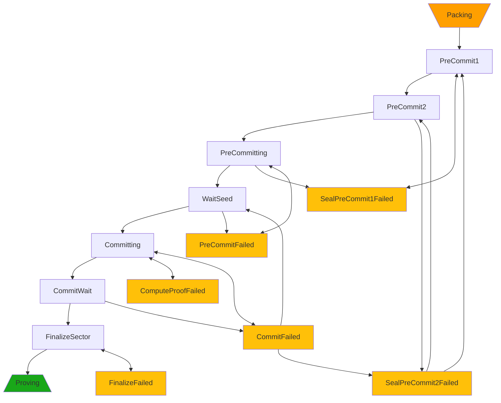

```mermaid
flowchart TB
    Packing[\Packing/] --> PreCommit1    
    PreCommit1 --> PreCommit2    
    PreCommit1 <--> SealPreCommit1Failed
    PreCommit2 --> PreCommitting
    PreCommit2 --> SealPreCommit2Failed    
    SealPreCommit2Failed --> PreCommit1
    SealPreCommit2Failed --> PreCommit2
    PreCommitting --> WaitSeed
    PreCommitting --> SealPreCommit1Failed
    PreCommitting <--> PreCommitFailed    
    WaitSeed --> Committing
    WaitSeed --> PreCommitFailed    
    Committing --> CommitWait
    Committing <--> ComputeProofFailed
    Committing <--> CommitFailed    
    CommitFailed --> WaitSeed
    CommitFailed --> SealPreCommit2Failed
    CommitWait --> FinalizeSector 
    CommitWait --> CommitFailed 
    FinalizeSector --> Proving[/Proving\]
    FinalizeSector <--> FinalizeFailed
    
    style Packing fill:#FF9F00;
    style Proving fill:#19A719;
    style SealPreCommit1Failed fill:#FFC009;
    style SealPreCommit2Failed fill:#FFC009;
    style PreCommitFailed fill:#FFC009;
    style ComputeProofFailed fill:#FFC009;
    style CommitFailed fill:#FFC009;
    style FinalizeFailed fill:#FFC009;
    

```

